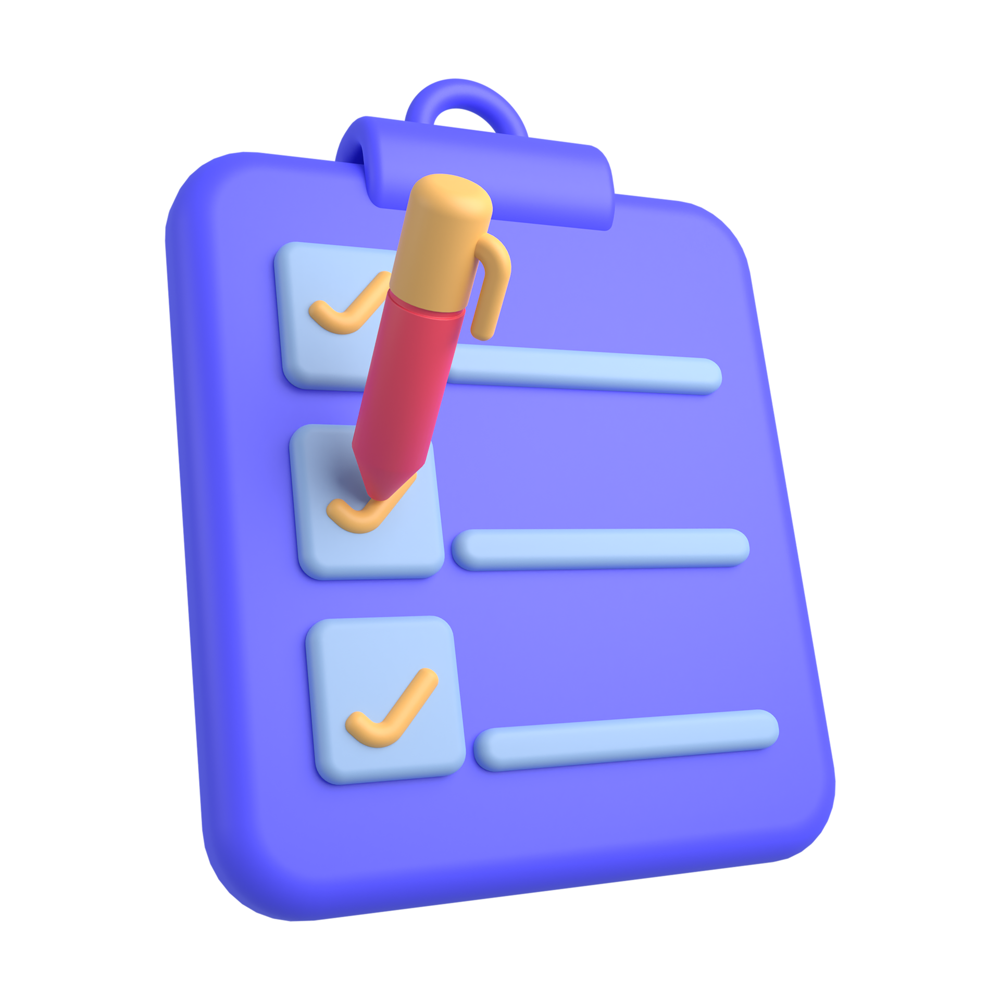

  

  <h1><strong>Histórico de Atualizações</strong></h1>
  
Todas as mudanças notáveis neste projeto serão documentadas neste arquivo. Conterá informações importantes sobre alterações no código

## [1.0.0]() - 2023/02/20

Descrição da versão

### Adicionados ao Software

- Adicionada nova funcionalidade no aplicativo que permite aos usuários criar temas personalizados para a interface.
- Adicionado suporte para idiomas adicionais, incluindo espanhol e francês.

### Melhoria de Funcionalidades

- Melhorado o desempenho da função de busca, otimizando o algoritmo usado para recuperar resultados.
- Atualizadas as bibliotecas de terceiros para as versões mais recentes, melhorando a estabilidade e segurança do aplicativo.

### Correção de Bugs

- Corrigido um bug que fazia o aplicativo travar ao acessar determinadas páginas.

O formato é baseado em [Keep a Changelog](http://keepachangelog.com/) e este projeto adere ao Controle de [Semantic Versioning](http://semver.org/).
